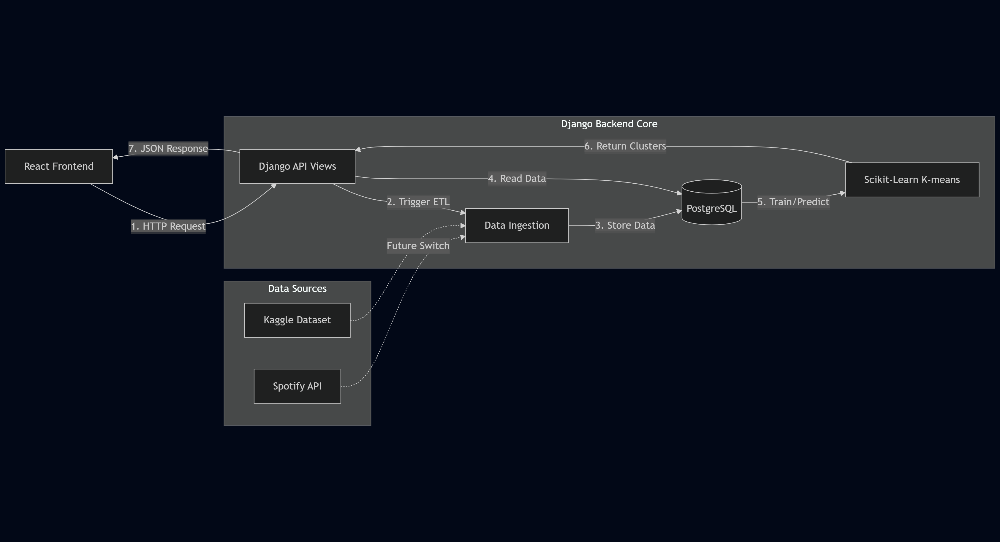
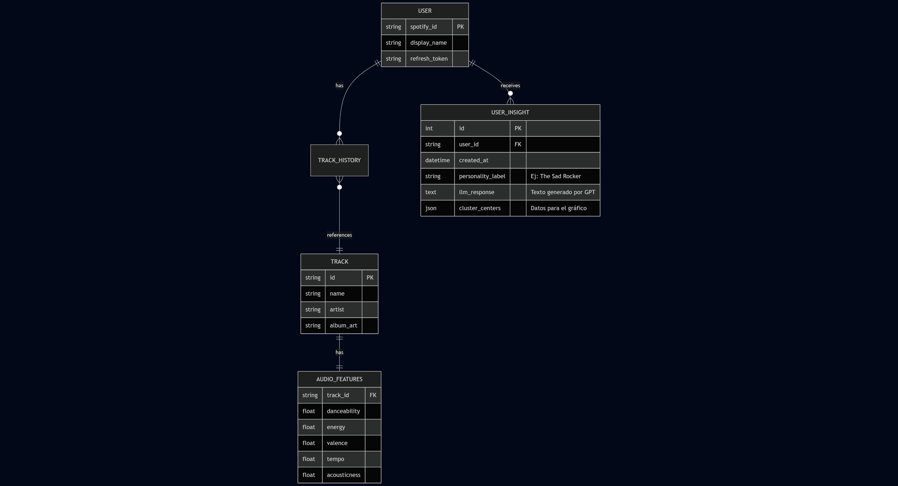

# Technical Design Document: Spotify ML Analyzer

| Metadata | Details |
| :--- | :--- |
| **Project Name** | Spotify ML Analyzer |
| **Author** | [Your Name] |
| **Status** | Draft v1.0 |
| **Date** | 2026-01-06 |

---

## 1. Introduction and Scope

### 1.1 Overview
"Spotify ML Analyzer" is a web application that leverages the Spotify Web API to extract user listening history and audio features. It applies Machine Learning algorithms to cluster songs based on their sonic characteristics and provides personalized insights and recommendations.

### 1.2 Goals
* Authenticate users securely via Spotify OAuth 2.0.
* Ingest and normalize audio feature data (tempo, valence, energy, etc.).
* Group songs into distinct "Mood Clusters" using Unsupervised Learning.
* Provide a recommendation engine based on mathematical similarity.

### 1.3 Out of Scope
* Real-time music streaming/playback (users will be redirected to Spotify).
* Social networking features (sharing, following other users).

---

## 2. System Architecture

The system follows a **Decoupled Client-Server** architecture, where a React frontend consumes a **Synchronous Monolithic Django API**. All backend logic (ETL, ML, AI) is executed sequentially within the HTTP request lifecycle

* **Client**: React
* **Server**: Django
* **Communication**: via JSON

The backend serves as a REST API and handles all heavy lifting regarding data processing and ML inference. All processes (Data fetching, ML inference, and AI generation) occur within the same HTTP request lifecycle.

* **Pattern:** MVC (Model-View-Controller) implemented via Django MVT.
* **Execution Flow:** Sequential and blocking. The API waits for external services (Spotify/Gemini) before responding to the client.

### 2.1 Data Flow Strategy: "Store-First, Analyze-Later"

To mitigate latency risks associated with synchronous architectures, the application splits the workflow into two distinct phases. This ensures that heavy external API calls (Spotify) and heavy computation (ML/AI) do not occur in a single blocking HTTP request.

#### Phase 1: Data Synchronization (ETL)
* **Trigger:** `POST /api/spotify/sync`
* **Goal:** Ingest raw data from external sources into the persistence layer.
* **Process:**
    1.  **Extract:** The backend uses `spotipy` to fetch the user's top 50 tracks and their corresponding audio features (valence, energy, etc.) from the **Spotify Web API**.
    2.  **Load:** Data is Upserted (Updated/Inserted) into the **PostgreSQL** database. This acts as a cache/buffer.
    3.  **Response:** Immediate confirmation to the frontend once data is secured.

#### Phase 2: Analysis & Inference
* **Trigger:** `GET /api/analysis/report`
* **Goal:** Process local data to generate insights.
* **Process:**
    1.  **Read:** The system queries the local **PostgreSQL** database (Sub-millisecond latency).
    2.  **ML Processing:** Scikit-learn executes **K-Means Clustering** on the audio features.
    3.  **AI Generation:** The cluster centroids are formatted into a text prompt and sent to the **Gemini API**.
    4.  **Response:** The client receives a JSON containing both the statistical cluster data (for charts) and the natural language personality insight.

---

## 3. Technology Stack

| Layer | Technology | Justification |
| :--- | :--- | :--- |
| **Frontend** | **React / Next.js** | Component-based UI, efficient state management for data visualization. |
| **Backend** | **Python (Django REST Framework)** | Robust, batteries-included framework. Excellent ORM for complex data modeling and built-in Admin panel for dataset management. |
| **Database** | **PostgreSQL** | Relational integrity is required for Users, Tracks, and their relationships. Native integration with Django ORM. |
| **ML Libraries** | **Scikit-learn, Pandas, NumPy** | Standard stack for vectorization, clustering, and data manipulation. |
| **Infrastructure** | **Docker & Railway** | Railway provides seamless deployment for Django/Postgres/Redis stacks. Docker ensures environment consistency. |
| **Gen AI** | **Gemini API** | Required to generate natural language descriptions and "personality insights" based on the user's ML clusters. |

---

## 4. Data Design

### 4.1 Entity-Relationship Diagram

The database schema focuses on storing user profiles and track metadata to minimize API calls to Spotify.

### 4.2 ETL Strategy (Extract, Transform, Load)
1. **Extract**: Pull user's "Top Tracks" and "Saved Tracks" from Spotify API.

2. **Transform**:

    * Fetch audio_features for the track IDs.

    * Normalize numerical values (scaling 0-1) to ensure fair weighting in the ML model.

3. **Load**: Upsert (Update/Insert) data into PostgreSQL to build a local dataset for analysis.

---

## 5. Machine Learning & AI Engineering

### 5.1 Feature Engineering & Preprocessing
* **Raw Input Features:** `[danceability, energy, loudness, speechiness, acousticness, instrumentalness, liveness, valence, tempo]`
* **Preprocessing:** * Implementation of **StandardScaler** to normalize all features (Z-Score).
    * This ensures comparable scales between `loudness` (dB), `tempo` (BPM), and 0-1 features.

### 5.2 Clustering Algorithm (The Profiler)
* **Algorithm:** **K-Means**.
* **Configuration:** Fixed to `k=5` clusters (based on initial training/testing).
* **Output:** Each track is assigned a `cluster_id`. The user's profile is defined by the distribution of their tracks across these 5 clusters.

### 5.3 LLM Analysis Layer (Generative AI)
Once clusters are defined, the system sends a summary to an LLM to generate a text-based report.
* **Provider:** Gemini.
* **Input (Prompt Context):** 
    * Center centroids of the user's 5 clusters (e.g., "High Energy + Low Valence").
    * Top 5 Artists and Genres.
* **Task:** "Analyze this musical profile and describe the user's personality in a [Professional/Sarcastic/Roast] tone."
* **Output:** A JSON object with fields like `{ "title": "The Melancholic Hipster", "description": "...", "roast": "..." }`.

## 6. API Specification (Key Endpoints)

| Module | Method | Endpoint | Description | 
| :--- | :--- | :--- | :--- | 
| Auth | `GET` | `/api/auth/url` | Returns the constructed Spotify OAuth URL. |
| Auth | `POST` | `/api/auth/login` | Exchanges the Spotify authorization code for tokens and creates the User session. |
| Data | `POST` | `/api/spotify/sync` | **(ETL Step)** Fetches user's Top 50 tracks + Audio Features from Spotify and saves them to PostgreSQL. |
| ML/AI | `GET` | `/api/analysis/report` | **(Inference Step)** Runs K-Means on local DB data, sends centroids to Gemini, and returns the personality profile. |
| User| `GET` | `/api/users/me` | Returns current user profile info (name, image) for the UI header. |

---

## 7. Constraints & Technical Debt (MVP Strategy)

### 7.1 Latency & Architecture
* **Constraint:** The system uses a **Synchronous Monolithic Django API** (Django View). Blocking operations (like fetching data from Spotify or waiting for Gemini) halt the worker thread.
* **Mitigation (The "Two-Step" Strategy):**
    * Instead of a single long-running `/analyze` endpoint (risk of 30s+ timeouts), we split the logic into two smaller requests:
        1. **ETL (`/sync`):** Fetches and saves data (~3-5s).
        2. **Inference (`/report`):** Reads local DB and calls AI (~3-5s).
    * The Frontend handles the UX by showing progress steps ("Syncing..." -> "Analyzing...").

### 7.2 Rate Limiting (Spotify)
* **Strategy:** Since we process requests synchronously, we handle rate limits with simple Python `time.sleep()` logic if necessary.
* **Scope:** We limit the analysis to the user's "Top 50 Tracks" initially to minimize API calls and execution time.

### 7.3 Authentication
* **Standard:** Django handles sessions via `django-allauth` linked to Spotify OAuth, keeping the implementation simple and secure without external auth providers (like Auth0).