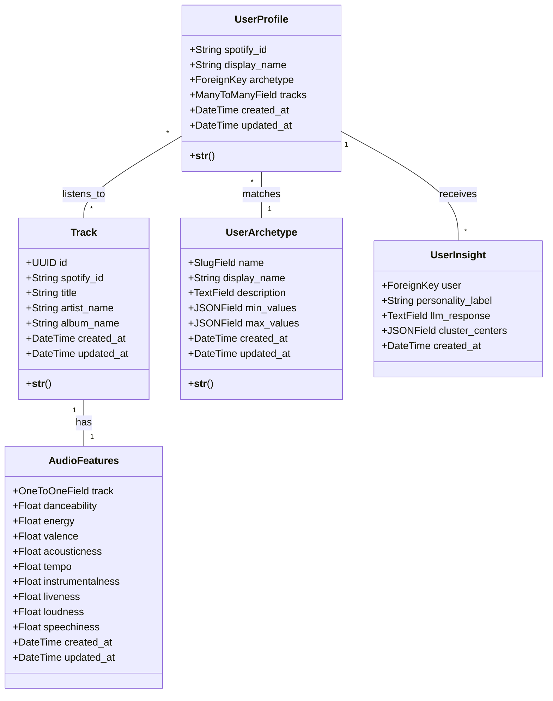

# Class Diagram - Spotify ML Analyzer

This document describes the backend class structure (Django Models) and their relationships, aligned with **Phase 2: Simulation Engine**.

## Class Diagram (Mermaid)

## Class Descriptions

### 1. `Track`
Represents a unique song in the system. Acts as the central entity for descriptive metadata.
- **Responsibility:** Store descriptive information (title, artist) agnostic of audio analysis.
- **Relationships:** Has a 1:1 relationship with `AudioFeatures`.

### 2. `AudioFeatures`
Contains raw numerical data extracted from the Spotify API or Dataset.
- **Responsibility:** Store audio metrics (0.0 - 1.0) required for ML algorithms (K-Means).
- **Note:** Separated from `Track` to optimize queries that only require metadata.

### 3. `UserArchetype`
Defines pre-calculated profiles (Clusters) used in the simulation.
- **Responsibility:** Serve as a "template" or "character" that the user selects in Phase 2.
- **Example:** "The Sad Rocker" (High Energy, Low Valence).

### 4. `UserProfile`
Represents the end user (simulated or real).
- **Responsibility:** Link a user identifier with their listening history and assigned archetype.
- **Phase 2:** Used to store the simulated session.
- **Phase 5:** Will be used to store the real Spotify profile.

### 5. `UserInsight`
Stores the results of AI analysis.
- **Responsibility:** Persist the report generated by Gemini to avoid regenerating it on every visit.
