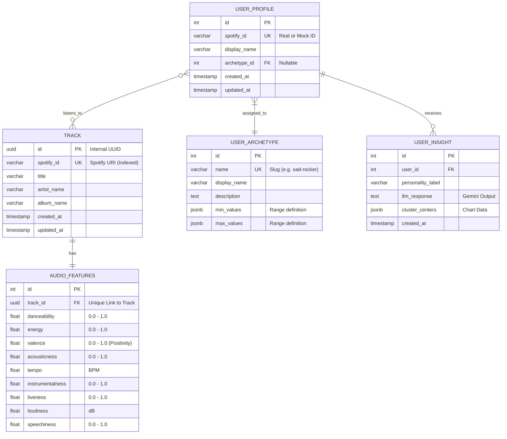

# Database Schema - Spotify ML Analyzer

This document details the PostgreSQL database schema implemented for **Phase 2: Simulation Engine**.

## Entity Relationship Diagram (ERD)

## Data Dictionary

### Table: `api_track`
| Column | Type | Constraints | Description |
| :--- | :--- | :--- | :--- |
| `id` | UUID | PK, Default `uuid4` | Internal unique system identifier. |
| `spotify_id` | VARCHAR(255) | Unique, Indexed | Original Spotify ID (e.g., `4iV5W9u...`). Business key. |
| `title` | VARCHAR(255) | Not Null | Song title. |
| `artist_name` | VARCHAR(255) | Not Null | Main artist name. |
| `album_name` | VARCHAR(255) | Not Null | Album name. |

### Table: `api_audiofeatures`
| Column | Type | Constraints | Description |
| :--- | :--- | :--- | :--- |
| `track_id` | UUID | FK (Track), Unique | 1:1 relationship with the Tracks table. |
| `danceability` | FLOAT | Not Null | How suitable a track is for dancing (0.0 to 1.0). |
| `energy` | FLOAT | Not Null | Perceptual measure of intensity and activity (0.0 to 1.0). |
| `valence` | FLOAT | Not Null | Musical positiveness (0.0 = sad, 1.0 = happy). |
| `tempo` | FLOAT | Not Null | Estimated tempo in BPM. |
| `loudness` | FLOAT | Default 0.0 | Average loudness in decibels (dB). |

### Table: `api_userarchetype`
| Column | Type | Constraints | Description |
| :--- | :--- | :--- | :--- |
| `name` | VARCHAR(50) | Unique, Slug | Technical identifier (e.g., `high-intensity`). |
| `min_values` | JSONB | Not Null | Dictionary with minimum values to filter tracks for this archetype. |
| `max_values` | JSONB | Not Null | Dictionary with maximum values. |

### Table: `api_userprofile`
| Column | Type | Constraints | Description |
| :--- | :--- | :--- | :--- |
| `spotify_id` | VARCHAR(255) | Unique | User ID (simulated or real). |
| `archetype_id` | INT | FK (UserArchetype), Nullable | Archetype assigned to the current session. |
| `tracks` | M2M | - | Many-to-Many relationship with `Track` (Listening history). |
