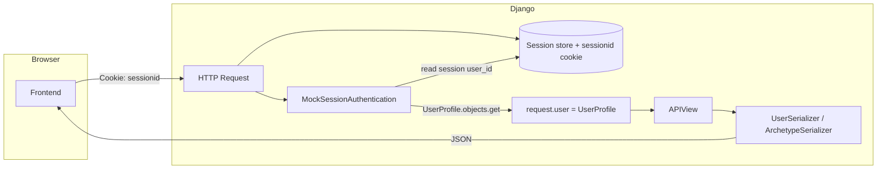
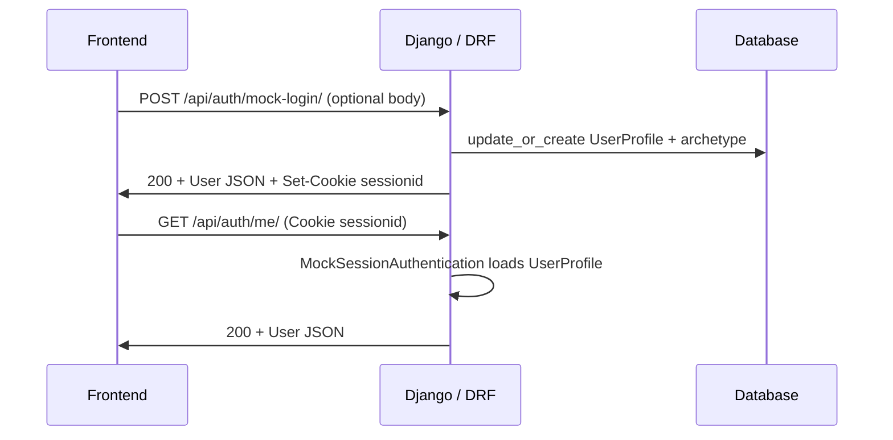
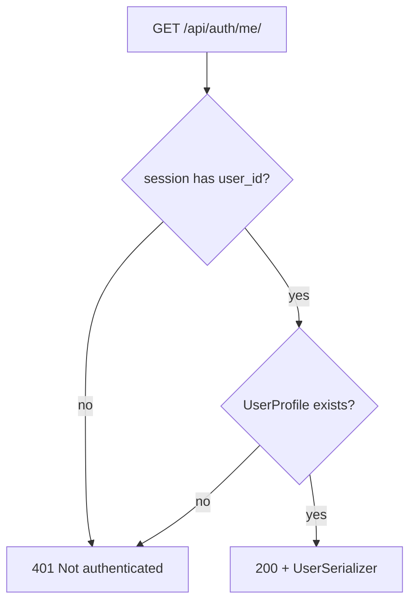

# API Contract — Simulation Mode (Mock Auth)

Quick-reference document for integrating the **frontend** with the backend as implemented in **Phase 2-03**: session-based simulated authentication, mock profile, and a stable JSON contract.

**Last reviewed:** 2026-03-20

---

## Table of contents

- [1. Purpose and scope](#api-contract-purpose)
- [2. Glossary](#api-contract-glossary)
- [3. Diagrams](#api-contract-diagrams)
  - [3.1 Component flow](#api-contract-diagram-flow)
  - [3.2 Sequence: mock login then `/me/`](#api-contract-diagram-sequence)
  - [3.3 401 decision on `/me/`](#api-contract-diagram-401)
- [4. File map → responsibility](#api-contract-files)
- [5. HTTP contract](#api-contract-http)
- [6. JSON contract](#api-contract-json)
- [7. Design decisions (mock)](#api-contract-decisions)
- [8. Frontend checklist](#api-contract-checklist)
- [9. Upcoming endpoints (out of scope here)](#api-contract-next)
- [10. References](#api-contract-refs)

---

<a id="api-contract-purpose"></a>

## 1. Purpose and scope

This document explains **how an HTTP client obtains and keeps a “user” in simulation mode** without Spotify OAuth: routes under `/api/`, Django session cookie, domain user as [`UserProfile`](../../backend/api/models.py), and JSON responses shaped by [`UserSerializer`](../../backend/api/serializers.py).

**Includes:** current mock-auth endpoints, JSON shape, cookie ↔ session ↔ DRF flow, and links to relevant source files.

**Excludes:** environment setup (see README), auto-generated OpenAPI, and Phase 2-04 endpoints (`/api/profile/...`) until they are implemented.

---

<a id="api-contract-glossary"></a>

## 2. Glossary

| Term | Meaning |
|------|---------|
| **Django session** | Server-side store keyed by the `sessionid` cookie; after mock login we store `user_id` (and `archetype_id`). |
| **`UserProfile`** | Domain “end user” model (simulated or future real user); in mock mode there is usually one row with `spotify_id = "mock_user_session"`. It's a custom model that is used to store the user's information. It's not a `django.contrib.auth.models.User` (could be implemented in later phases when switching to live mode). |
| **`UserArchetype`** | Musical profile (cluster); `name` is the unique slug used in the optional body field `archetype_id`. |
| **`request.user` (DRF)** | After [`MockSessionAuthentication`](../../backend/api/authentication.py), this is a `UserProfile` instance, not `django.contrib.auth.models.User`. |
| **JSON contract** | Fields exposed by serializers; the client should type against this, not the full ORM model. |

---

<a id="api-contract-diagrams"></a>

## 3. Diagrams

<a id="api-contract-diagram-flow"></a>

### 3.1 Component flow (request → cookie → auth → user → serializer)



<a id="api-contract-diagram-sequence"></a>

### 3.2 Sequence: mock login then `/me/`



<a id="api-contract-diagram-401"></a>

### 3.3 401 decision on `/me/`



---

<a id="api-contract-files"></a>

## 4. File map → responsibility

| File | Role |
|------|------|
| [`backend/core/urls.py`](../../backend/core/urls.py) | Global `api/` prefix → includes the `api` app routes. |
| [`backend/api/urls.py`](../../backend/api/urls.py) | Declares `auth/mock-login/` and `auth/me/`. |
| [`backend/core/settings.py`](../../backend/core/settings.py) | `REST_FRAMEWORK`: default `MockSessionAuthentication` and global `AllowAny`. |
| [`backend/api/authentication.py`](../../backend/api/authentication.py) | `MockSessionAuthentication`: session `user_id` → loads `UserProfile` as `request.user`. |
| [`backend/api/views.py`](../../backend/api/views.py) | `MockLoginView` (POST), `MeView` (GET, `IsAuthenticated`). |
| [`backend/api/serializers.py`](../../backend/api/serializers.py) | JSON contract: `ArchetypeSerializer`, `UserSerializer`. |
| [`backend/api/models.py`](../../backend/api/models.py) | `UserProfile`, `UserArchetype`, `Track`, `AudioFeatures`, etc. |
| [`backend/api/management/commands/seed_archetypes.py`](../../backend/api/management/commands/seed_archetypes.py) | Seeds archetypes; required for random or slug-based login. |

---

<a id="api-contract-http"></a>

## 5. HTTP contract

**Base path:** `/api/` (defined in [`backend/core/urls.py`](../../backend/core/urls.py)).

| Method | Path | Auth | Body | Relevant responses |
|--------|------|------|------|-------------------|
| `POST` | `/api/auth/mock-login/` | No | Optional: `{"archetype_id": "<slug>"}` — see [`MockLoginView`](../../backend/api/views.py) | `200` + user JSON; `404` unknown archetype; `500` no archetypes in DB |
| `GET` | `/api/auth/me/` | Yes (session) | — | `200` + same user JSON; `401` missing session or invalid `user_id` |

Typical errors return JSON with an `error` key (string), e.g. `{"error": "Archetype '...' not found."}`.

---

<a id="api-contract-json"></a>

## 6. JSON contract

Indicative types for the client (aligned with [`backend/api/serializers.py`](../../backend/api/serializers.py)).

### `Archetype` (nested object)

| Field | Type | Notes |
|-------|------|--------|
| `name` | string | Unique slug, e.g. `the-high-intensity` |
| `display_name` | string | Human-readable label |
| `description` | string | Long text |

**Not exposed** by this serializer: `min_values`, `max_values` (still in the DB for backend logic / future profile endpoints).

### `User` (mock-login and `/me/` responses)

| Field | Type | Notes |
|-------|------|--------|
| `spotify_id` | string | In simulation: `"mock_user_session"` |
| `display_name` | string | |
| `avatar_url` | string | Generated URL (DiceBear); not a DB column |
| `archetype` | `Archetype` \| null | Could be `null` if the model allowed it; mock flow always assigns one |

Illustrative example:

```json
{
  "spotify_id": "mock_user_session",
  "display_name": "Spotify Explorer",
  "avatar_url": "https://api.dicebear.com/7.x/avataaars/svg?seed=mock_user_session",
  "archetype": {
    "name": "the-euphoric-social",
    "display_name": "The Euphoric / Social",
    "description": "User seeks dopamine and social connection..."
  }
}
```

---

<a id="api-contract-decisions"></a>

## 7. Design decisions (mock)

1. **Session + cookie**: Persistence across requests without a custom JWT; the client must send cookies (`credentials: 'include'` or equivalent).
2. **Single mock `UserProfile`**: `update_or_create` with `spotify_id="mock_user_session"` avoids creating a new row on every login POST during development.
3. **`UserProfile` as `request.user`**: We do not use `django.contrib.auth.User`; [`MockSessionAuthentication`](../../backend/api/authentication.py) and the model’s [`is_authenticated`](../../backend/api/models.py) property are required so `IsAuthenticated` works on [`MeView`](../../backend/api/views.py).
4. **`archetype_id` in body = slug `name`**: Readable and stable compared to internal numeric IDs.
5. **Global `AllowAny` + `IsAuthenticated` on `/me/`**: Login stays public; session checks apply only where needed ([`backend/core/settings.py`](../../backend/core/settings.py)).
6. **Serializers as contract**: The client does not rely on unexposed ORM fields; archetype JSON ranges can appear on future endpoints without breaking the `User` type.

---

<a id="api-contract-checklist"></a>

## 8. Frontend checklist

- [ ] After `POST /api/auth/mock-login/`, persist and resend the **session cookie** on subsequent calls.
- [ ] Call **`GET /api/auth/me/`** on app load to hydrate state (if `401` → mock “login” flow).
- [ ] Type the user against [JSON contract](#api-contract-json), not ad-hoc response shapes.
- [ ] To force a profile in QA: `POST` with `{"archetype_id": "<slug>"}` (values defined in [`seed_archetypes`](../../backend/api/management/commands/seed_archetypes.py)).

---

<a id="api-contract-next"></a>

## 9. Upcoming endpoints (out of scope here)

Phase 2-04 is expected to add something like `GET /api/profile/summary/` and `GET /api/profile/tracks/`. When they exist, extend this document or add a “Profile API” section with its own schemas.

---

<a id="api-contract-refs"></a>

## 10. References

- [`docs/development/DEVLOG.md`](../development/DEVLOG.md) — entry *Phase 2-03: Mock Authentication & Archetype Provider*.
